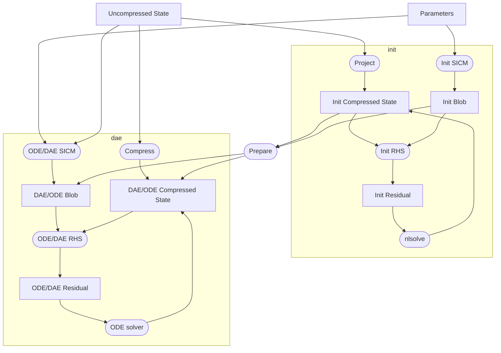

```mermaid
flowchart TD
    US[Uncompressed State]
    P[Parameters]
    subgraph init
        isicm([Init SICM])
        ICS[Init Compressed State]
        IB[Init Blob]
        irhs([Init RHS])
        IR[Init Residual]
        nlsolve([nlsolve])
        pr([Project])
    end
    subgraph dae
        osicm([ODE/DAE SICM])
        OCS[DAE/ODE Compressed State]
        OB[DAE/ODE Blob]
        orhs([ODE/DAE RHS])
        OR[ODE/DAE Residual]
        osolve([ODE solver])
        cmp([Compress])
    end
    prep([Prepare])
    US --> pr --> ICS
    US --> cmp --> OCS
    P --> isicm --> IB
    P --> osicm --> OB
    US --> osicm
    ICS --> irhs
    IB --> irhs
    irhs --> IR
    IR --> nlsolve
    nlsolve --> ICS
    OB --> orhs
    OCS --> orhs
    orhs --> OR
    OR --> osolve
    osolve --> OCS
    ICS --> prep
    IB --> prep
    prep --> OCS
    prep --> OB
```